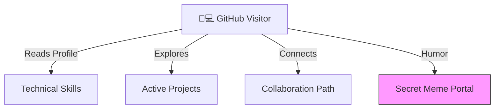
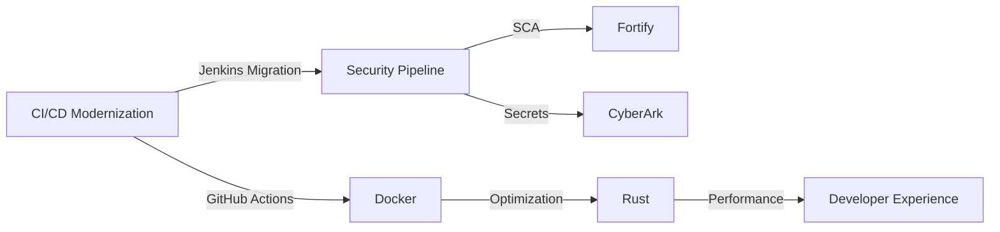
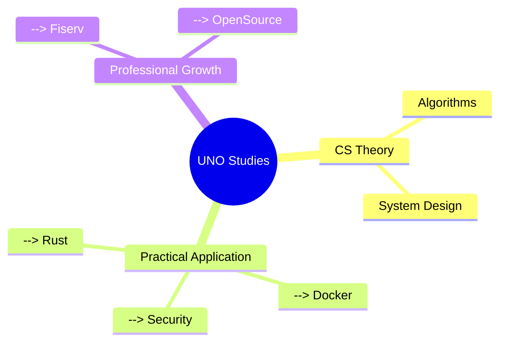

# 👋 Brandon A. Calderon-Morales
 
** 💻 Just another dev **



## 🛠️ Core Competencies



## 🌱 Active Project: [Dev Environment](https://github.com/BA-CalderonMorales/dev-environment)

```mermaid
%% Project Evolution
gantt
    title 2025 Development Journey
    dateFormat  YYYY-MM-DD
    axisFormat %b %Y
    section Core
```

**Why It Matters:**  
*"Developer environments should be like oxygen: invisible when working perfectly, immediately responsive when adjustments are needed."*

## 🧠 Knowledge Matrix



## 🤝 Collaboration Pathways

[](https://www.linkedin.com/in/bcalderonmorales-cmoe)
[](https://img.shields.io/badge/Jokes_Understood-87%25-yellow)

---

> "The environment should empower first, enforce second, and entertain always.  
> After all, we're building the future - might as well enjoy the ride."