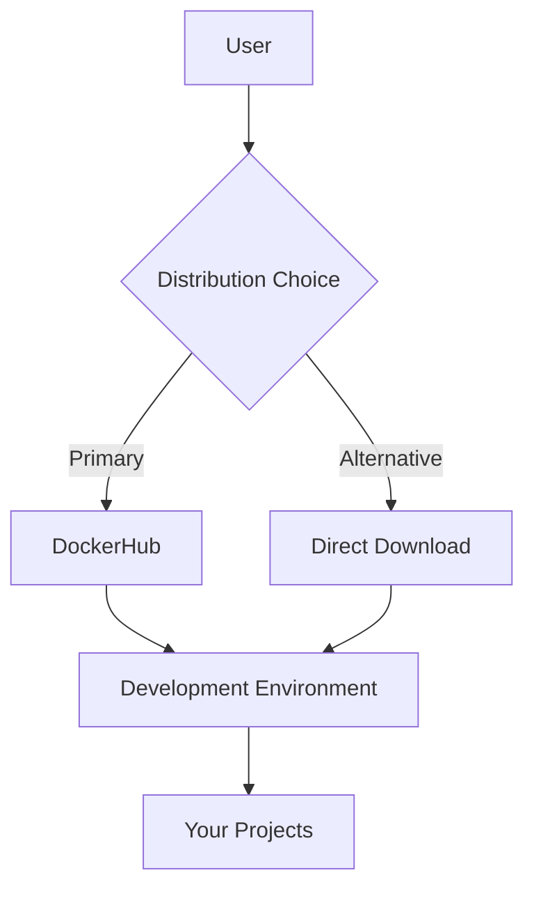
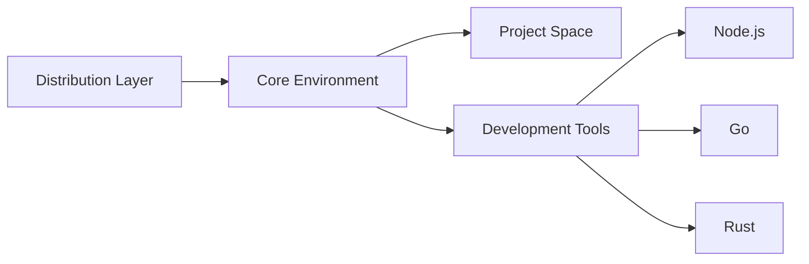

# Visual Documentation

## Distribution Flow

```mermaid
graph TD
    A[User] --> B{Distribution Choice}
    B -->|Primary| C[DockerHub]
    B -->|Alternative| D[Direct Download]
    C --> E[Development Environment]
    D --> E
    E --> F[Your Projects]
```

## Component Architecture

```mermaid
graph LR
    A[Distribution Layer] --> B[Core Environment]
    B --> C[Project Space]
    B --> D[Development Tools]
    D --> E[Node.js]
    D --> F[Go]
    D --> G[Rust]
```