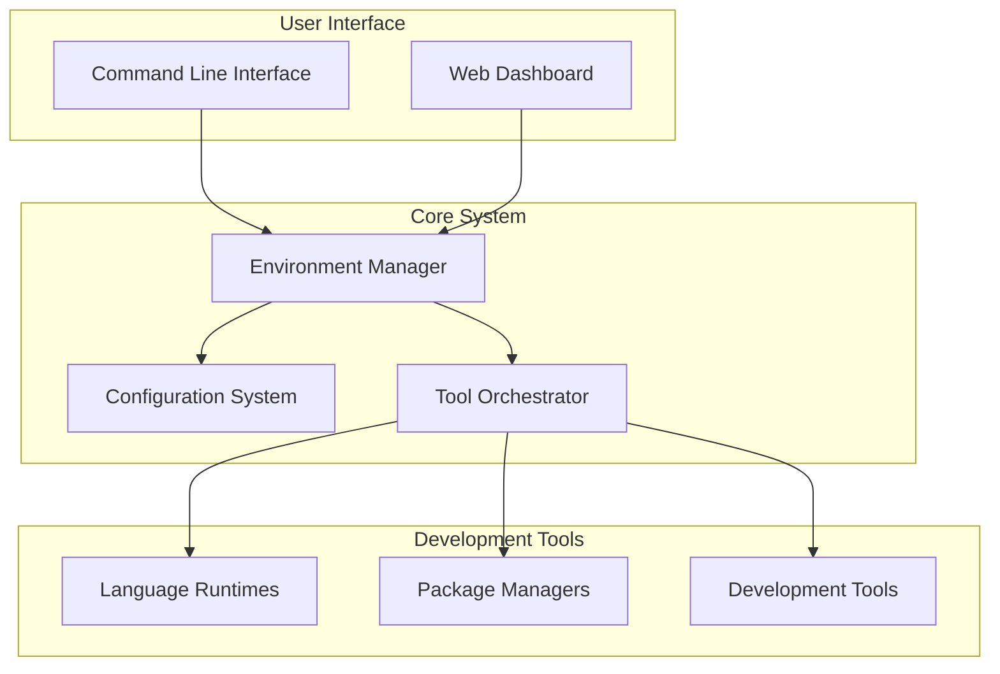
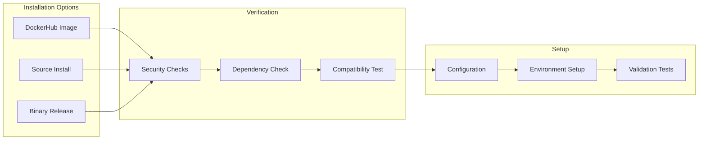
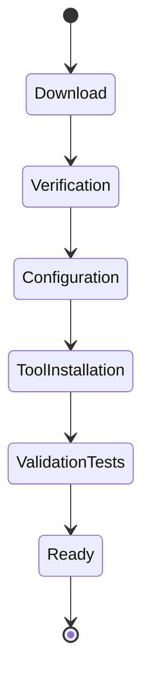
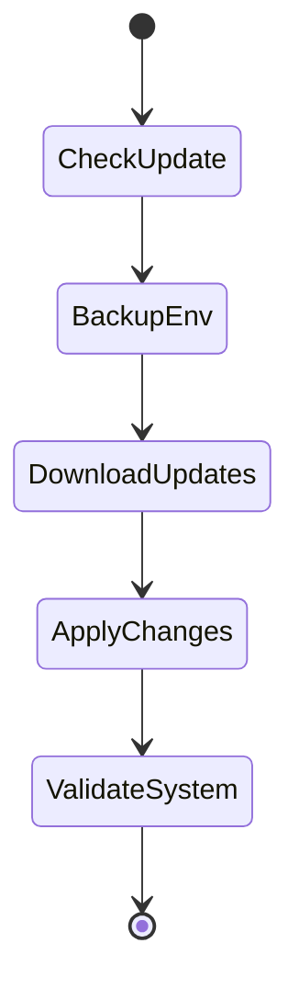
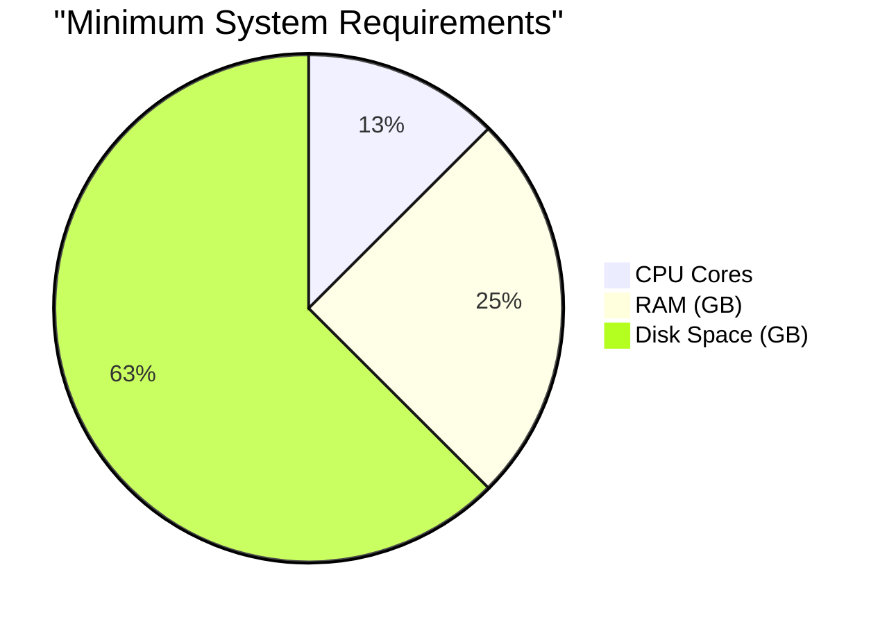
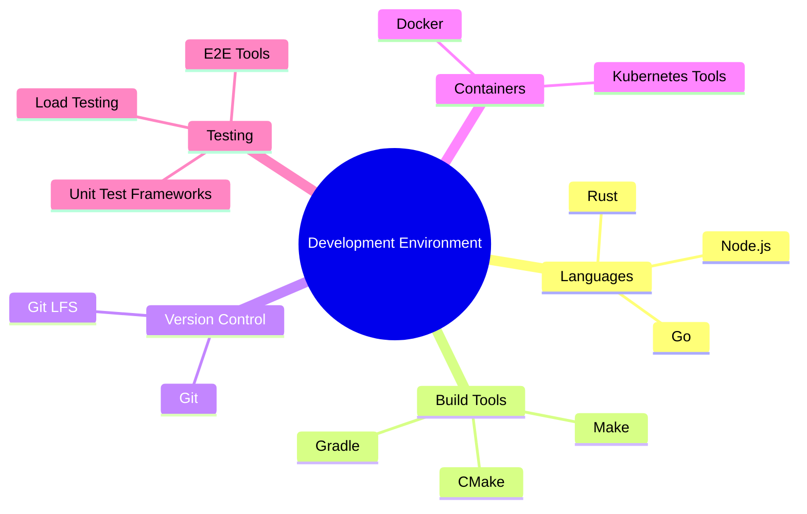

# Visual Documentation

## System Overview

### High-Level Architecture


### Distribution Workflow


### Component Relationships
```mermaid
graph TD
    subgraph Core Services
        direction LR
        CONFIG[Configuration Service]
        HEALTH[Health Monitor]
        UPDATE[Update Manager]
    end

    subgraph Runtime Environment
        direction LR
        NODE[Node.js Runtime]
        GO[Go Tools]
        RUST[Rust Toolchain]
        DOCKER[Docker Engine]
    end

    subgraph Developer Tools
        direction LR
        GIT[Git Integration]
        CI[CI Tools]
        DEBUG[Debug Tools]
    end

    CONFIG --> Runtime Environment
    HEALTH --> Runtime Environment
    UPDATE --> Runtime Environment
    Runtime Environment --> Developer Tools
```

## Environment States

### Fresh Installation


### Update Process


## Quick Reference

### Required System Resources


### Tool Categories


## Notes

- All diagrams are generated using Mermaid.js
- System requirements may vary based on enabled features
- Component relationships show default configurations