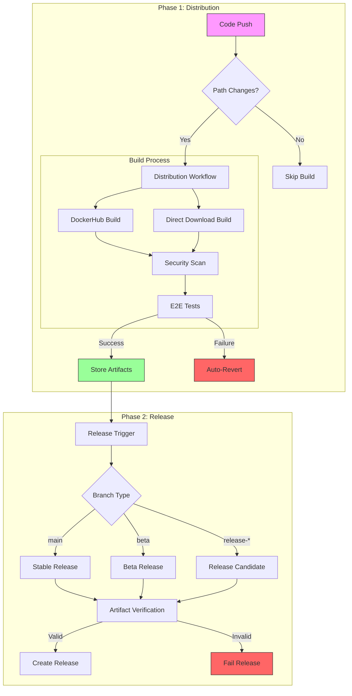
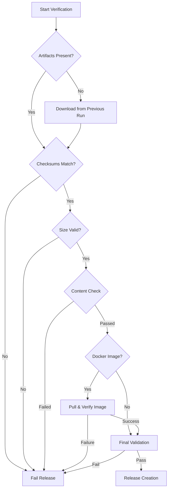
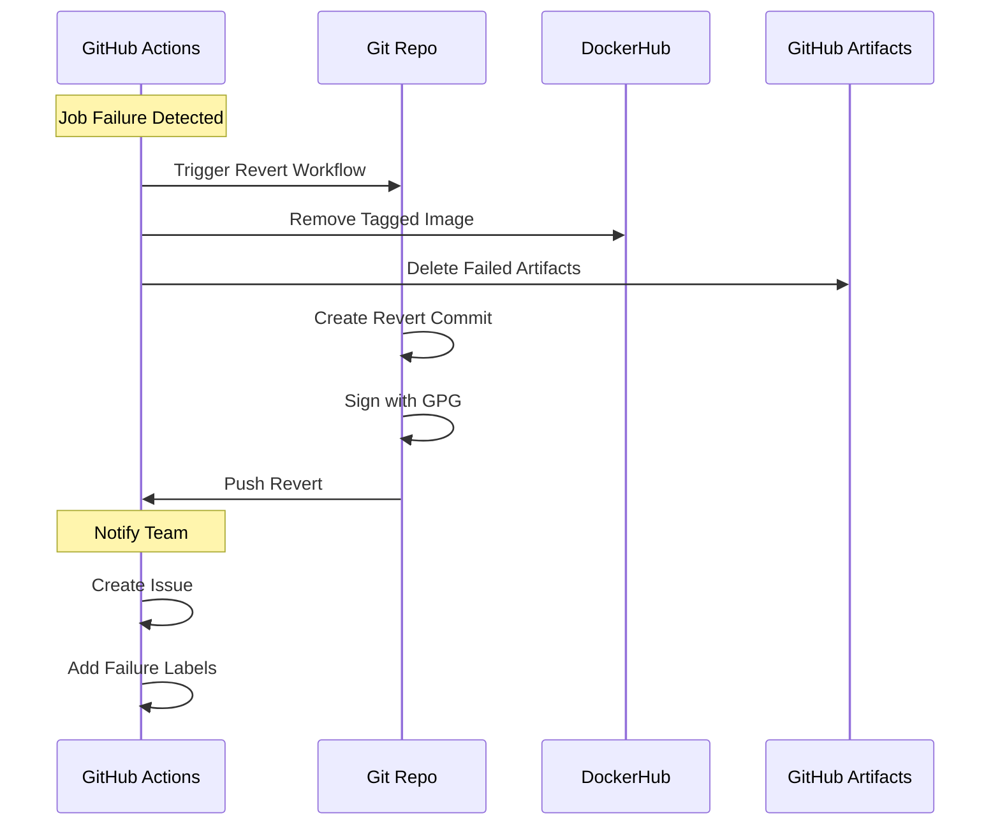
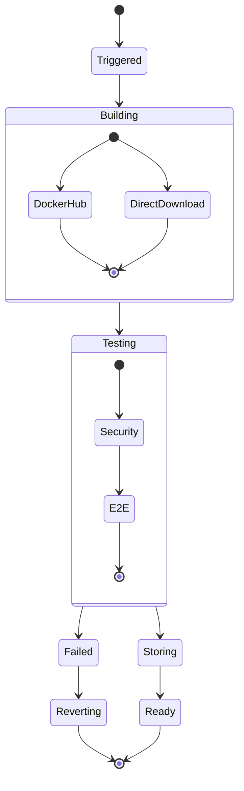
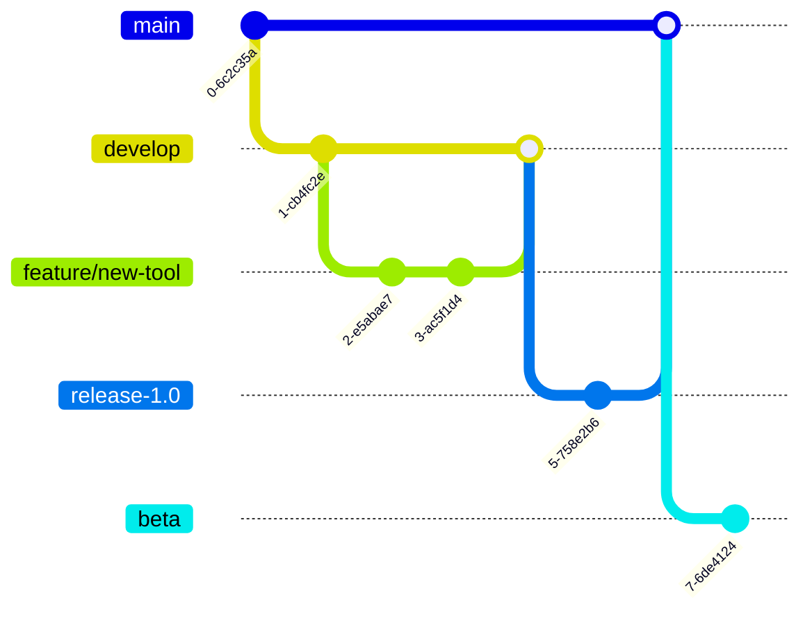
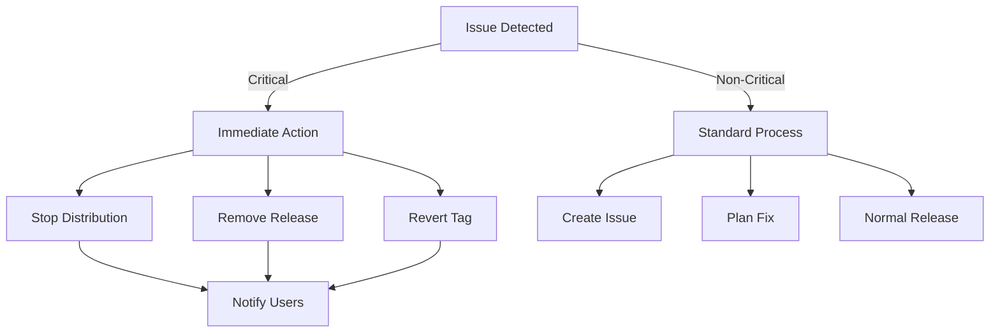
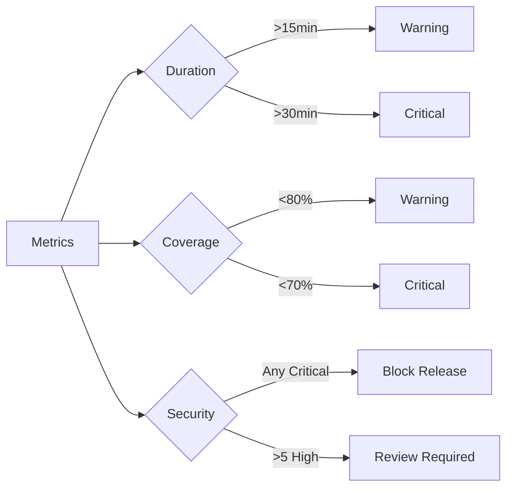

# Workflow Documentation

## Overview
Our GitHub Actions workflows implement a secure, two-phase release process with robust artifact validation and automated rollbacks.

## System Architecture

### Complete Pipeline Overview


### Artifact Verification Pipeline


### Error Recovery Flow


## Workflow States & Transitions

### Distribution Pipeline States


## Critical Path Analysis

### Success Path
1. Code Push → Path Check
2. Build Distribution
3. Security Scans
4. E2E Tests
5. Artifact Storage
6. Release Creation
7. Documentation Update

### Failure Points & Mitigations

| Stage | Failure | Mitigation |
|-------|---------|------------|
| Build | Docker build fails | Auto-revert, cached layers |
| Tests | Security vulnerabilities | Block release, create issue |
| Artifacts | Storage failure | Retry mechanism, temp storage |
| Release | Missing artifacts | Re-run distribution |
| DockerHub | Rate limits | Authenticated pulls, caching |
| GPG | Signing fails | Fallback keys, manual intervention |

## Developer Guidelines

### Branch Strategy


### Release Checklist

✅ Pre-Release
- [ ] All tests passing
- [ ] Security scan clear
- [ ] Artifacts validated
- [ ] Documentation updated
- [ ] Version bumped
- [ ] Changelog updated

✅ Release
- [ ] Branch protection rules met
- [ ] Required approvals obtained
- [ ] GPG signing configured
- [ ] Distribution workflow successful
- [ ] Artifacts available

✅ Post-Release
- [ ] Download links verified
- [ ] DockerHub image available
- [ ] Documentation links updated
- [ ] Release notes complete
- [ ] Notifications sent

### Common Pitfalls

❌ **Don't:**
- Push directly to protected branches
- Skip security scans
- Force-push to release branches
- Ignore failed tests
- Bypass branch protection
- Delete release tags

✅ **Do:**
- Use feature branches
- Wait for all checks
- Sign commits and tags
- Follow versioning scheme
- Update documentation
- Verify artifacts

## Emergency Procedures

### Release Rollback


### Quick Reference

🚨 **Emergency Contacts**
- GitHub Team: @github-team
- DevOps: @devops-team
- Security: @security-team

🔧 **Quick Commands**
```bash
# Revert last release
git revert $(git rev-list -n 1 $(git tag | sort -V | tail -n 1))

# Remove failed release
git tag -d v1.2.3
git push origin :v1.2.3

# Check artifact status
gh run download --name artifact-name
```

## Monitoring & Alerts

### Key Metrics
- Build Duration: < 15 minutes
- Test Coverage: > 80%
- Security Issues: 0 critical
- Release Time: < 30 minutes
- Artifact Size: < 1GB

### Alert Thresholds


## Future Enhancements

### Planned Improvements
- [ ] Automated dependency updates
- [ ] Advanced artifact caching
- [ ] Release candidate promotion
- [ ] Automated changelog
- [ ] Performance metrics
- [ ] Compliance checks