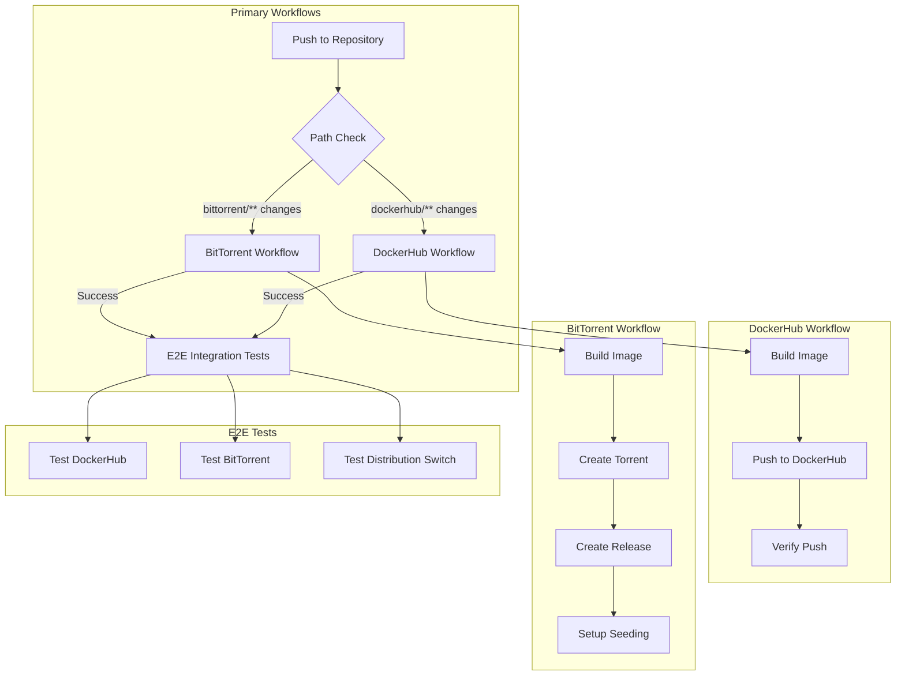
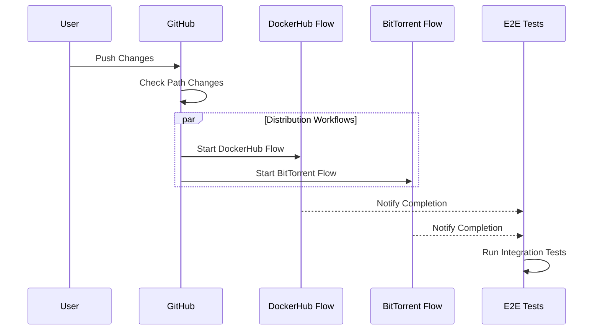

# Workflow Architecture

## Overview
This repository uses GitHub Actions workflows for building, testing, and distributing the development environment. Each distribution method has its own workflow, with an additional E2E integration test workflow that runs after successful builds.

## Workflow Diagram


## Workflow Triggers

### DockerHub Build and Push
- **Triggers on changes to:**
  - `distributions/dockerhub/**`
  - `startup/**`
  - `.github/workflows/**`
  - `docs/**`
- **Main Jobs:**
  1. Build Docker image
  2. Push to DockerHub
  3. Verify accessibility

### BitTorrent Build and Seed
- **Triggers on changes to:**
  - `distributions/bittorrent/**`
  - `distributions/dockerhub/Dockerfile`
  - `startup/**`
  - `.github/workflows/**`
- **Main Jobs:**
  1. Build Docker image
  2. Create torrent file
  3. Generate magnet link
  4. Create GitHub release
  5. Setup seeding

### E2E Integration Tests
- **Triggers after:**
  - Successful completion of either distribution workflow
- **Main Jobs:**
  1. Test DockerHub distribution
  2. Test BitTorrent distribution
  3. Test distribution switching
  4. Generate test report

## Execution Order and Dependencies


## Common Workflow States
| State | Description | Next Action |
|-------|-------------|-------------|
| ✅ Success | All jobs completed | None needed |
| ❌ Failure | One or more jobs failed | Check specific job logs |
| ⏳ Waiting | Waiting for other workflow | Monitor dependencies |
| ⏭️ Skipped | Path conditions not met | None needed |

## Debugging Workflows
- Check the Actions tab for specific workflow runs
- Each job has detailed logs
- Failed steps are clearly marked
- Environment and secret issues show in logs

## Local Testing
You can test workflows locally using [act](https://github.com/nektos/act):
```bash
# Test DockerHub workflow
act -j build-and-push

# Test BitTorrent workflow
act -j build-and-seed

# Test E2E workflow
act -j e2e-tests
```

## Adding New Workflows
When adding new distribution methods:
1. Create workflow file in `.github/workflows/`
2. Define appropriate triggers
3. Add to E2E test suite
4. Update this documentation 