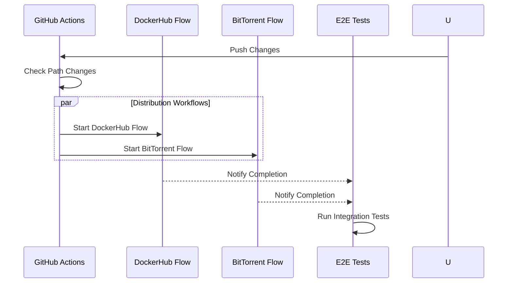

# Workflow Documentation

## Overview
Our GitHub Actions workflows automate testing, building, and releasing the development environment.

## Workflow Components

### Toolchain Setup
- Uses stable Rust toolchain
- Captures version information for debugging:
  ```bash
  rustc --version   # Rust compiler version
  cargo --version   # Cargo package manager version
  rustup --version  # Toolchain manager version
  ```

### Distribution Workflows


## Common Workflow States
| State | Description | Next Action |
|-------|-------------|-------------|
| ✅ Success | All jobs completed | Release creation |
| ❌ Failure | One or more jobs failed | Check specific job logs |
| ⏳ Waiting | Waiting for other workflow | Monitor dependencies |
| ⏭️ Skipped | Path conditions not met | None needed |

## Version Control
- Semantic versioning (MAJOR.MINOR.PATCH)
- Automatic patch version increment on successful tests
- Version format: `vX.Y.Z` (e.g., v0.1.0)
- Release names include version and changes

## Debugging Workflows
- Check the Actions tab for specific workflow runs
- Each job has detailed logs with toolchain versions
- Failed steps are clearly marked
- Environment and secret issues show in logs

## Adding New Workflows
When adding new distribution methods:
1. Create workflow file in `.github/workflows/`
2. Define appropriate triggers
3. Add to E2E test suite
4. Update this documentation 

## Release Process
- Triggered after successful E2E tests
- Collects artifacts from all workflows
- Generates comprehensive release notes
- Includes all distribution methods
- Documents availability constraints 

## Workflow Development Guide

### Directory Structure
- `.github/workflows/`: All GitHub Actions workflow files
  - `bittorrent-build-and-seed.yml`: BitTorrent distribution workflow
  - `dockerhub-build-and-push.yml`: DockerHub distribution workflow
  - `e2e-integration-test.yml`: Integration test workflow
  - `create-release.yml`: Release creation workflow

### Development Process
1. Create feature branch from develop
2. Make workflow changes
3. Push to feature branch
4. Create PR to develop
5. Verify workflow runs in PR
6. Merge if successful

### Best Practices
- Keep workflows focused on a single responsibility
- Test changes through pull requests
- Document environment variables and secrets
- Follow existing patterns for consistency 