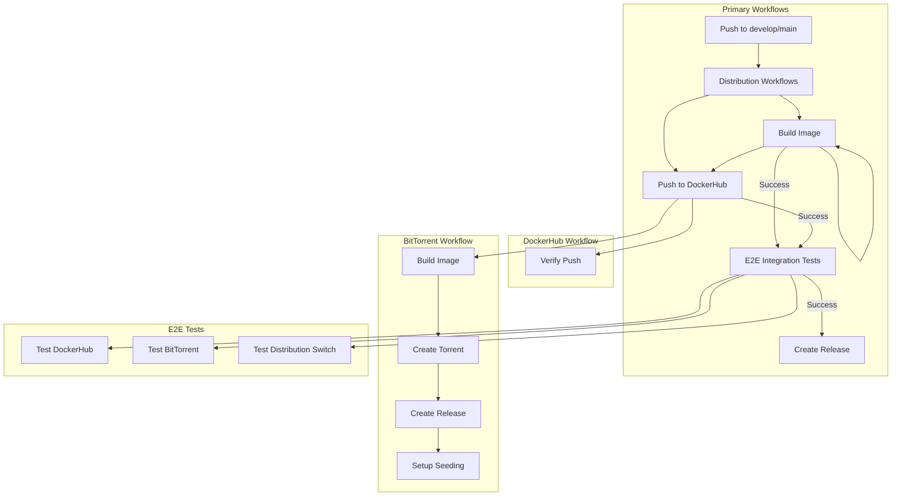
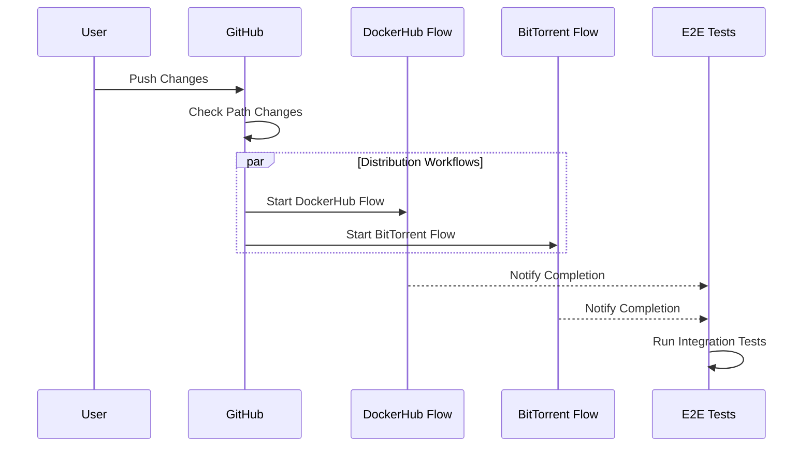

# Workflow Architecture

## Overview
This repository uses GitHub Actions workflows for building, testing, and distributing the development environment. Each distribution method has its own workflow, with an additional E2E integration test workflow that runs after successful builds.

## Workflow Diagram

## Workflow Triggers

### DockerHub Build and Push
- **Triggers on changes to:**
  - `distributions/dockerhub/**`
  - `startup/**`
  - `.github/workflows/**`
  - `docs/**`
- **Main Jobs:**
  1. Build Docker image
  2. Push to DockerHub
  3. Verify accessibility

### BitTorrent Build and Seed
- **Triggers on changes to:**
  - `distributions/bittorrent/**`
  - `distributions/dockerhub/Dockerfile`
  - `startup/**`
  - `.github/workflows/**`
- **Main Jobs:**
  1. Build Docker image
  2. Create torrent file
  3. Generate magnet link
  4. Create GitHub release
  5. Setup seeding

### E2E Integration Tests
- **Triggers after:**
  - Successful completion of either distribution workflow
- **Main Jobs:**
  1. Run creator workflow tests
     - Dockerfile validation
     - Distribution creation
     - BitTorrent generation
  2. Run user workflow tests
     - DockerHub installation
     - BitTorrent installation
     - IDE integration
     - Development workflow verification
  3. Generate test report

## Execution Order and Dependencies

## Common Workflow States
| State | Description | Next Action |
|-------|-------------|-------------|
| ✅ Success | All jobs completed | None needed |
| ❌ Failure | One or more jobs failed | Check specific job logs |
| ⏳ Waiting | Waiting for other workflow | Monitor dependencies |
| ⏭️ Skipped | Path conditions not met | None needed |

## Debugging Workflows
- Check the Actions tab for specific workflow runs
- Each job has detailed logs
- Failed steps are clearly marked
- Environment and secret issues show in logs

## Adding New Workflows
When adding new distribution methods:
1. Create workflow file in `.github/workflows/`
2. Define appropriate triggers
3. Add to E2E test suite
4. Update this documentation 

## Release Process
- Triggered after successful E2E tests
- Collects artifacts from all workflows
- Generates comprehensive release notes
- Includes all distribution methods
- Documents availability constraints 

## Workflow Development Guide

### Directory Structure
- `.github/workflows/`: All GitHub Actions workflow files
  - `bittorrent-build-and-seed.yml`: BitTorrent distribution workflow
  - `dockerhub-build-and-push.yml`: DockerHub distribution workflow
  - `e2e-integration-test.yml`: Integration test workflow
  - `create-release.yml`: Release creation workflow

### Development Process
1. Create feature branch from develop
2. Make workflow changes
3. Push to feature branch
4. Create PR to develop
5. Verify workflow runs in PR
6. Merge if successful

### Best Practices
- Keep workflows focused on a single responsibility
- Test changes through pull requests
- Document environment variables and secrets
- Follow existing patterns for consistency 